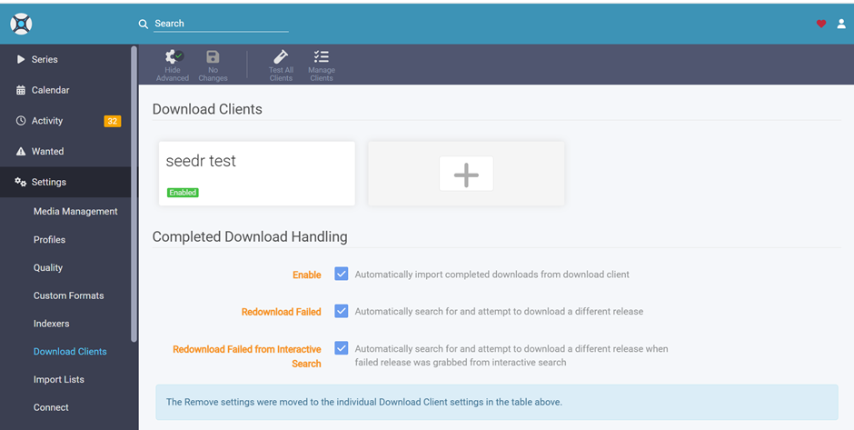
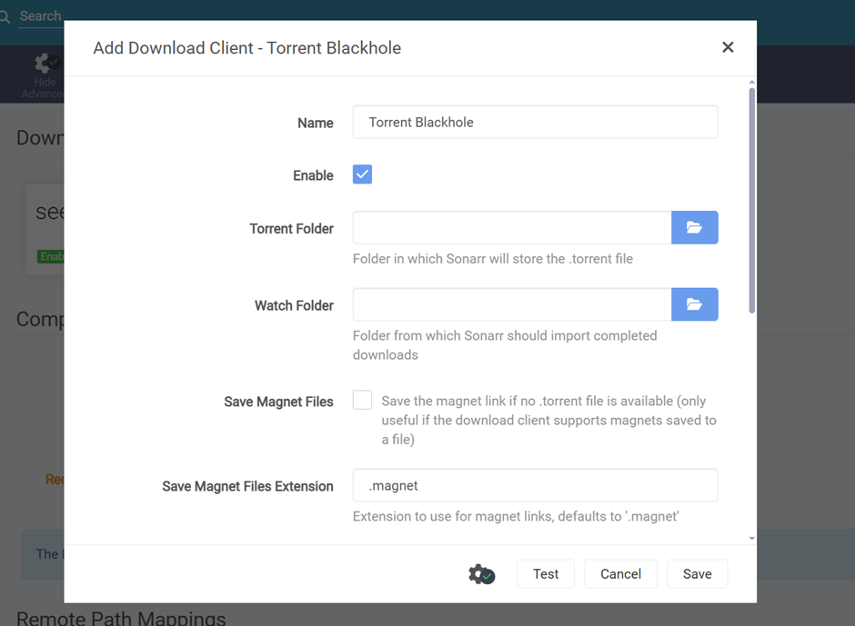
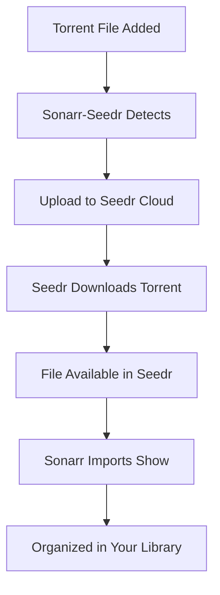

# 🚀 Sonarr-Seedr Integration

**Automatically download torrents to Seedr cloud storage and sync with Sonarr for seamless TV show management.**

[](https://www.microsoft.com/windows)
[](https://python.org)
[](https://fastapi.tiangolo.com)
[](LICENSE)

## ✨ Features

- 🔄 **Automatic Torrent Watching** - Monitors directories for new torrent files
- ☁️ **Seedr Cloud Integration** - Downloads torrents directly to your Seedr cloud storage
- 📺 **Sonarr Integration** - Automatically imports downloaded shows to Sonarr
- 🌐 **Web Interface** - Easy-to-use dashboard for management
- 📱 **OAuth2 Authentication** - Secure Seedr account connection
- 🚀 **Portable** - No installation required, just run and go!

## 🎯 Quick Start

> ⚠️ **IMPORTANT**: This plugin requires Sonarr's **"Torrent Blackhole"** download client. See [configuration section](#b-configure-sonarr-download-client) below.

### 1. Download & Run

1. **Download** the latest release: [`SonarrSeedr-v1.1.10-20251611_130828.zip`](https://github.com/jose987654/sonarr-plugin/releases/download/v1.1.10/SonarrSeedr-v1.1.10-20251611_130828.zip)
2. **Extract** the ZIP file to any folder (e.g., `C:\SonarrSeedr\`)
3. **Run** `SonarrSeedr.exe` (wait 10-30 seconds for startup)
4. **Browser** will automatically open to http://localhost:8242

> 💡 **Tip**: If you see a Windows Defender warning, click "More info" → "Run anyway". The app is safe!

### 2. Authenticate with Seedr

> ⚠️ **First Time?** You need a free Seedr account - [Sign up here](https://www.seedr.cc) (takes 2 minutes)

1. Click **"Start Authentication"** in the plugin dashboard
2. You'll receive a device code (e.g., `AB12-CD34`)
3. Go to [https://www.seedr.cc/device](https://www.seedr.cc/device) in a new tab
4. Enter the code and click **"Approve"**
5. Return to the plugin - ✅ **Authentication complete!**

> 📝 **Note**: Device codes expire after 15 minutes. If it expires, just start again.

### 3. Configure Folders & Sonarr (CRITICAL STEP!)

> ⚠️ **MOST IMPORTANT**: The plugin and Sonarr MUST use the SAME folder paths! This is how they communicate.

#### A. Set Up Folders in the Plugin

1. In the plugin web interface, go to **"Settings"** or **"Configuration"**
2. Set your folders:
   - **Torrent Folder**: Where you'll drop `.torrent` files (e.g., `D:\Torrents\`)
   - **Watch Folder**: Where downloads will be saved (e.g., `D:\Downloads\`)
3. Click **"Save Configuration"**
4. **Write down these paths** - you'll need them for Sonarr!

#### B. Configure Sonarr Download Client

> 🎯 **CRITICAL**: This plugin works ONLY with Sonarr's **"Torrent Blackhole"** download client. Do not use qBittorrent, Transmission, Deluge, or any other client!

**Step-by-Step Instructions:**

1. **Open Sonarr** web interface at `http://localhost:8989`
2. **Click Settings** (gear icon ⚙️) in the top menu
3. **Click "Download Clients"** in the left sidebar
4. **Click the "+" button** to add a new download client
5. **Select "Torrent Blackhole"** from the list

   

6. **Fill in the configuration form** with these settings:

   - **Name**: `Sonarr-Seedr Plugin` (or any name you like)
   - **Enable**: ✅ **MUST be checked!**
   - **Torrent Folder**: Use the **EXACT SAME PATH** you configured in the plugin
     - Example: `D:\Torrents\`
     - ⚠️ Must match plugin exactly!
   - **Watch Folder**: Use the **EXACT SAME PATH** you configured in the plugin
     - Example: `D:\Downloads\`
     - ⚠️ Must match plugin exactly!
   - **Save Magnet Files**: ✅ Check this box
   - **Magnet File Extension**: `.magnet`

   

7. **Click "Test"** button - you should see a green checkmark ✅
8. **Click "Save"** to save the configuration
9. **Verify** the download client shows as "Enabled" in the Download Clients list

**❌ Common Mistakes to Avoid:**

- Using a different download client (qBittorrent, Deluge, etc.) - this plugin requires Torrent Blackhole!
- Using different folder paths in Sonarr than in the plugin
- Forgetting to enable the download client (checkbox must be checked!)
- Not checking the "Save Magnet Files" option
- Typing folder paths with typos or extra spaces

#### 🔗 Why Same Folders Matter

```
Plugin watches:        Torrent Folder → Detects .torrent files → Uploads to Seedr
Plugin downloads to:   Watch Folder   → Saves completed files
Sonarr watches:        Watch Folder   → Imports TV shows

If folders don't match = Plugin and Sonarr can't communicate = Nothing works!
```

> ⚠️ **CRITICAL**: Both applications watch the same folders. If paths don't match exactly, the automation breaks!

## 📖 How It Works

### The Complete Workflow



### Step-by-Step Process

1. **Torrent Detection**: Plugin watches your Torrent Folder for new `.torrent` files
2. **Cloud Upload**: Torrent files are automatically uploaded to your Seedr account
3. **Seedr Processing**: Seedr downloads the torrent content to your cloud storage
4. **Local Download**: Plugin downloads the completed files to your Watch Folder
5. **Sonarr Integration**: Sonarr watches the same Watch Folder and imports the shows
6. **Library Organization**: Your TV shows are organized and ready to watch!

### 🔄 Folder Watching Explained

```
[You] → Drop .torrent into D:\Torrents\
         ↓
[Plugin] → Watches D:\Torrents\ → Detects file → Uploads to Seedr
         ↓
[Seedr] → Downloads torrent in cloud
         ↓
[Plugin] → Downloads to D:\Downloads\
         ↓
[Sonarr] → Watches D:\Downloads\ → Imports show → Organizes to TV library
```

**Both watch the same folders = Seamless automation!**

### 🎬 Daily Usage (It's This Easy!)

1. Find a TV show torrent (EZTV, RARBG, etc.)
2. Download the `.torrent` file
3. Drop it into your **Torrent Folder** (the one you configured)
4. **That's it!** Everything else happens automatically 🎉

Watch progress at:

- **Plugin Dashboard**: http://localhost:8242
- **Seedr Cloud**: https://www.seedr.cc
- **Sonarr**: http://localhost:8989

## 🛠️ Configuration

### Quick Configuration Summary

| Setting            | Example                 | Purpose                         | Configure In              |
| ------------------ | ----------------------- | ------------------------------- | ------------------------- |
| **Torrent Folder** | `D:\Torrents\`          | Where you drop `.torrent` files | Plugin AND Sonarr (same!) |
| **Watch Folder**   | `D:\Downloads\`         | Where completed files are saved | Plugin AND Sonarr (same!) |
| **Sonarr Host**    | `http://localhost:8989` | Your Sonarr web interface URL   | Plugin only               |

> 💡 **Important**: Use the SAME folders in both the plugin and Sonarr settings!

### Sonarr Download Client Requirements

| Requirement             | Value                     | Why                                         |
| ----------------------- | ------------------------- | ------------------------------------------- |
| **Download Client**     | Torrent Blackhole (ONLY)  | Plugin designed to work with this method    |
| **Enable Checkbox**     | Must be checked ✅        | Sonarr won't use it if disabled             |
| **Save Magnet Files**   | Must be checked ✅        | Allows magnet link support                  |
| **Torrent Folder Path** | Must match plugin exactly | Both apps watch the same folder             |
| **Watch Folder Path**   | Must match plugin exactly | Both apps watch the same folder for imports |

### Seedr Account Tiers

| Account Type | Storage   | Speed   | Cost |
| ------------ | --------- | ------- | ---- |
| **Free**     | 2GB       | Limited | Free |
| **Premium**  | Up to 1TB | Fast    | Paid |

> ✅ **Pre-configured**: Client ID is already set up - just authenticate!

## 🌐 Web Interface

Access the web interface at **http://localhost:8242**

### Dashboard Features

| Feature                   | Description                           |
| ------------------------- | ------------------------------------- |
| 📊 **Dashboard**          | Overview of your setup and status     |
| ⚙️ **Configuration**      | Manage Sonarr and download settings   |
| 📁 **Torrent Management** | View and manage torrent downloads     |
| 🔧 **Settings**           | Configure directories and preferences |

### Quick Links

| Link                  | URL                              | Purpose              |
| --------------------- | -------------------------------- | -------------------- |
| **Plugin Dashboard**  | http://localhost:8242            | Main interface       |
| **API Documentation** | http://localhost:8242/docs       | Interactive API docs |
| **Status Check**      | http://localhost:8242/api/status | Service status       |

## 🔧 Troubleshooting

### Common Issues & Quick Fixes

| Problem                         | Solution                                                                                                         |
| ------------------------------- | ---------------------------------------------------------------------------------------------------------------- |
| **App won't start**             | 1. Run as Administrator<br>2. Use `debug.bat` to see errors<br>3. Check Windows Defender exceptions              |
| **Port 8242 busy**              | Run: `SonarrSeedr.exe --port 8001`                                                                               |
| **Authentication fails**        | 1. Check internet connection<br>2. Try new device code (codes expire in 15 min)<br>3. Clear browser cache        |
| **Wrong download client**       | ⚠️ You MUST use "Torrent Blackhole" in Sonarr - not qBittorrent, Deluge, or Transmission!                        |
| **Sonarr not importing**        | ⚠️ **CHECK FOLDER PATHS!** Verify plugin and Sonarr use EXACT same Torrent & Watch Folder paths                  |
| **Torrents not processing**     | 1. Check folder permissions<br>2. Verify watcher is running<br>3. Check file extension (`.torrent` or `.magnet`) |
| **Download client not enabled** | In Sonarr Download Clients, make sure "Torrent Blackhole" has the Enable checkbox ✅ checked                     |
| **Downloads not appearing**     | 1. Verify folders match in plugin & Sonarr<br>2. Check Seedr account storage<br>3. Check internet connection     |

### 🐛 Debug Mode

**Having issues?** Run `debug.bat` instead of `SonarrSeedr.exe` to see detailed error messages.

**Log Location**: `_internal\folder_watcher.log`

## 📋 Requirements

### System Requirements

| Requirement | Minimum             | Recommended          |
| ----------- | ------------------- | -------------------- |
| **OS**      | Windows 10 64-bit   | Windows 11           |
| **RAM**     | 512MB               | 1GB+                 |
| **Storage** | 100MB               | 1GB+                 |
| **Network** | Internet connection | High-speed internet  |
| **Ports**   | 8242 available      | 8242, 8989 available |

### What You Need

1. **Seedr Account** (Required)

   - Free: [Sign up at seedr.cc](https://www.seedr.cc)
   - Takes 2 minutes to create

2. **Sonarr** (Optional but recommended)

   - Download: [sonarr.tv](https://sonarr.tv)
   - For automatic TV show organization

3. **The Plugin** (You're here!)
   - Download: [`SonarrSeedr-v1.1.10-20251611_130828.zip`](https://github.com/jose987654/sonarr-plugin/releases/download/v1.1.10/SonarrSeedr-v1.1.10-20251611_130828.zip)

## 🚀 Advanced Usage

### Command Line Options

```bash
# Run on different port
SonarrSeedr.exe --port 8001

# Enable debug logging
SonarrSeedr.exe --log-level debug

# Disable browser auto-open
SonarrSeedr.exe --no-browser
```

### Directory Structure

```
SonarrSeedr/
├── SonarrSeedr.exe          # Main application
├── debug.bat                # Debug script
├── SIMPLE_USAGE.md          # Quick start guide
├── PORTABLE_USAGE.md        # Detailed documentation
└── _internal/               # Application files
```

## 🤝 Contributing

Contributions are welcome! Please feel free to submit a Pull Request.

### Development Setup

1. Clone the repository
2. Install dependencies: `pip install -r requirements.txt`
3. Run the application: `python run.py`

## 📄 License

This project is licensed under the MIT License - see the [LICENSE](LICENSE) file for details.

## 🙏 Acknowledgments

- [Seedr](https://www.seedr.cc) for cloud torrent service
- [Sonarr](https://sonarr.tv) for TV show management
- [FastAPI](https://fastapi.tiangolo.com) for the web framework
- [PyInstaller](https://pyinstaller.org) for executable packaging

## 📚 Documentation Files

| File                             | Description                     | Link                              |
| -------------------------------- | ------------------------------- | --------------------------------- |
| 📄 **README.md**                 | Project overview (you are here) | This file                         |
| ⚡ **QUICK_SETUP_STEPS.md**      | Fast 5-minute setup guide       | [View](QUICK_SETUP_STEPS.md)      |
| 📖 **WINDOWS_SETUP_GUIDE.md**    | Complete detailed guide         | [View](WINDOWS_SETUP_GUIDE.md)    |
| 🌐 **WINDOWS_SETUP_GUIDE.html**  | Web version of setup guide      | [View](WINDOWS_SETUP_GUIDE.html)  |
| 🏠 **index.html**                | Main landing page               | [View](index.html)                |
| 🔄 **HOW_TO_UPDATE_RELEASES.md** | Auto-update release links guide | [View](HOW_TO_UPDATE_RELEASES.md) |

> 💡 **New Users**: Start with `QUICK_SETUP_STEPS.md` for a fast introduction!
> 💡 **Developers**: See `HOW_TO_UPDATE_RELEASES.md` to set up automatic release link updates!

## 📞 Support & Help

### Need Help?

1. 📖 Read the [Complete Setup Guide](WINDOWS_SETUP_GUIDE.html)
2. 🔧 Run `debug.bat` to see error details
3. 📝 Check log file: `_internal\folder_watcher.log`

### Having Issues?

- Check the **Troubleshooting** section above
- Make sure Seedr account has available storage
- Verify folder paths match in both plugin and Sonarr
- Restart the plugin and try again

---

## 🎉 Quick Start Summary

1. **Download**: [`SonarrSeedr-v1.1.10-20251611_130828.zip`](https://github.com/jose987654/sonarr-plugin/releases/download/v1.1.10/SonarrSeedr-v1.1.10-20251611_130828.zip)
2. **Extract**: Unzip to `C:\SonarrSeedr\`
3. **Run**: Double-click `SonarrSeedr.exe`
4. **Authenticate**: Connect your Seedr account
5. **Configure**: Set your folders
6. **Enjoy**: Drop torrents and watch them download!

---

**⭐ Star this repository if you find it helpful!**

_Made with ❤️ for the Plex/Sonarr community_
